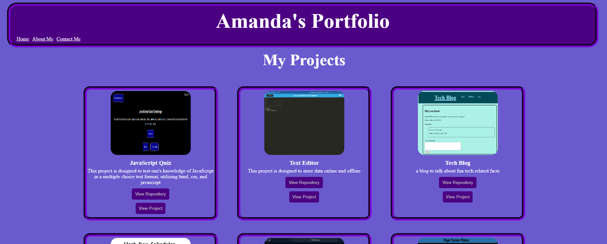

# React Portfolio

## Description

This project was created to showcase my knowledge, skills, and abilities when it comes to creating projects using html, css, and javascript with React.

This program is deployed using Netlify

## Table of Contents

- [User Story](#user-story)
- [Acceptance Criteria](#acceptance-criteria)
- [Access](#access)
- [Installation](#installation)
- [Usage](#usage)
- [Credits](#credits)
- [Questions](#questions)
- [License](#license)


## User Story
```md
AS AN employee looking for a job for a beginning web developer,
I WANT to create a portfolio of my projects to show case my abilities
SO THAT I can show that I am a good candidate for the position
```

## Acceptance Criteria

```md
GIVEN a single-page application portfolio for a web developer
WHEN I load the portfolio
THEN I am presented with a page containing a header, a section for content, and a footer
WHEN I view the header
THEN I am presented with the developer's name and navigation with titles corresponding to different sections of the portfolio
WHEN I view the navigation titles
THEN I am presented with the titles About Me, Portfolio, Contact, and Resume, and the title corresponding to the current section is highlighted
WHEN I click on a navigation title
THEN the browser URL changes and I am presented with the corresponding section below the navigation and that title is highlighted
WHEN I load the portfolio the first time
THEN the About Me title and section are selected by default
WHEN I am presented with the About Me section
THEN I see a recent photo or avatar of the developer and a short bio about them
WHEN I am presented with the Portfolio section
THEN I see titled images of six of the developer’s applications with links to both the deployed applications and the corresponding GitHub repositories
WHEN I am presented with the Contact section
THEN I see a contact form with fields for a name, an email address, and a message
WHEN I move my cursor out of one of the form fields without entering text
THEN I receive a notification that this field is required
WHEN I enter text into the email address field
THEN I receive a notification if I have entered an invalid email address
WHEN I am presented with the Resume section
THEN I see a link to a downloadable resume and a list of the developer’s proficiencies
WHEN I view the footer
THEN I am presented with text or icon links to the developer’s GitHub and LinkedIn profiles, and their profile on a third platform (Stack Overflow, Twitter)
```


## Access

To access this repository, please visit: https://github.com/avilwock/React-Portfolio. 

To view online application please visit: https://keen-queijadas-8741e1.netlify.app


## Installation

To install a local copy of this project on your machine, clone the repository to your computer, and then in the integrated terminal, type npm install

## Usage

To use this project, open the link through Netlify, which will take you to the homepage. On the homepage, you can view my project and click the links on each project item to access the repository or the deployed project.

 

 


## Credits

Logan Garland, Coding bootcamp, University of Irvine California

## Questions

For any questions, please contact me at: avilwock@gmail.com

## License

MIT License